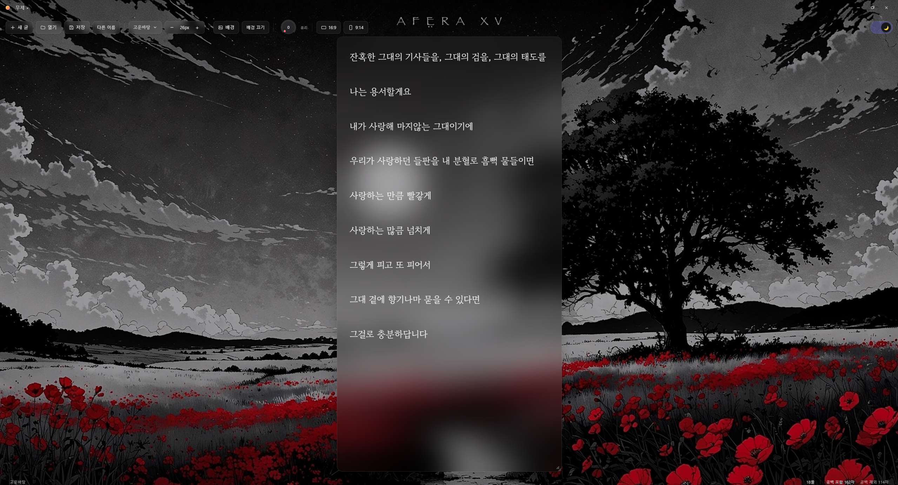
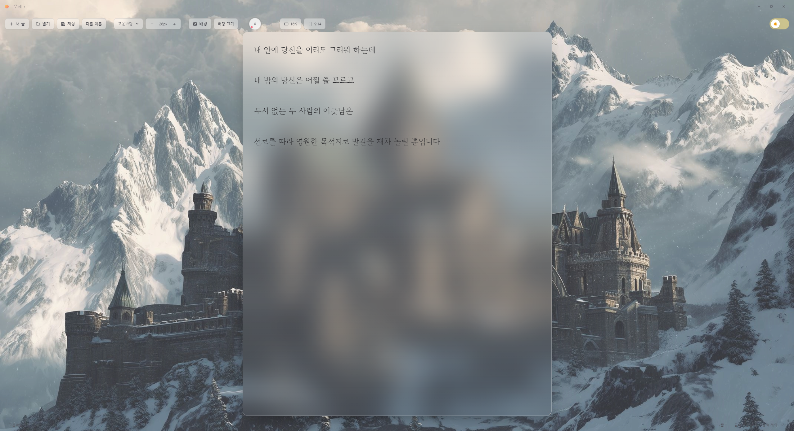
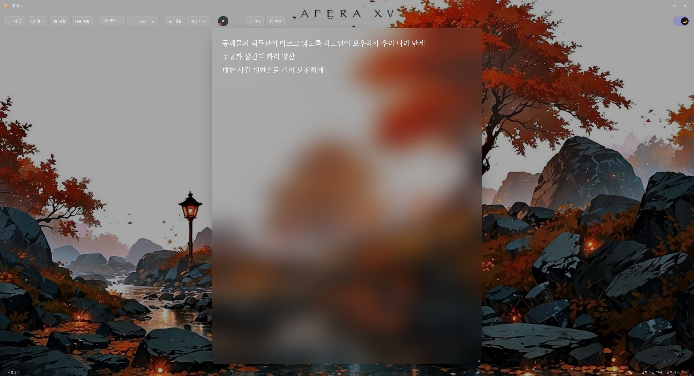

# ZenPad

> 똑같은 글을 쓰더라도 더 예쁜 노트에 — 긴 글에 몰입하기 위한 아름다운 윈도우 메모장.

ZenPad는 원고 집필이나 세계관 설정처럼 **챕터 단위의 긴 글**에 완전히 몰입할 수 있도록 만든 글래스모피즘 데스크톱 메모장입니다. Electron + React 기반의 프레임리스 윈도우 앱입니다.

## 📸 미리보기

| 다크 모드 | 라이트 모드 |
|---|---|
|  |  |
|  |  |

> 커스텀 타이틀 바, 유리 불투명도 다이얼, 폰트·노트 양식, 실시간 글자 수 상태 바.

## ✨ 주요 기능

- **프레임리스 윈도우** — OS 기본 타이틀 바를 제거한 커스텀 타이틀 바(최소화·최대화·닫기), 드래그로 창 이동
- **글래스모피즘 에디터** — 로컬 이미지를 전체 배경으로 설정하고 `backdrop-blur`로 반투명 유리 질감 구현
- **유리 불투명도 다이얼** — 회전 다이얼로 에디터 배경의 투명도를 실시간·세밀하게 조절 (근접 시 확대 모션)
- **포커스 모드** — 타이핑을 시작하면 UI가 부드럽게 사라지고 글과 배경만 남으며, 마우스를 움직이면 다시 등장
- **테마 & 타이포그래피** — 부드러운 전환의 다크/라이트 모드, 3종 한글 웹폰트(나눔명조·고운바탕·노토 고딕) 선택, 글자 크기 조절
- **파일명 인라인 수정** — 좌상단 파일명을 클릭해 바로 이름 변경 (Enter·blur 확정)
- **에디터 크기 조절** — 드래그로 자유 리사이즈 + `16:9` / `9:14` 추천 비율 프리셋
- **실시간 글자 수** — 하단 상태 바에 공백 포함/제외 글자 수와 줄 수 표시
- **로컬 파일 I/O** — `.txt` 저장·불러오기 (Electron IPC)
- **오프라인 폰트** — 웹폰트를 앱에 동봉해 인터넷 없이도 동일한 서체 표시

## ⌨️ 단축키

| 단축키 | 동작 |
|---|---|
| `Ctrl + N` | 새 문서 |
| `Ctrl + O` | 불러오기 |
| `Ctrl + S` | 저장 |
| `Ctrl + Shift + S` | 다른 이름으로 저장 |

## 🛠 기술 스택

- **Framework**: Electron + React (Vite)
- **Styling**: Tailwind CSS, Framer Motion
- **Fonts**: `@fontsource` (나눔명조 · 노토 산스 KR · 고운바탕)
- **Packaging**: electron-builder (NSIS)

## 🚀 개발 및 빌드

```bash
npm install        # 의존성 설치
npm run dev        # 개발 모드 (Vite + Electron, HMR)
npm run build      # 렌더러 프로덕션 빌드
npm run dist       # 윈도우 .exe 인스톨러 생성 (release/ 폴더)
```

## 📦 다운로드

빌드된 설치 파일은 [Releases](https://github.com/D5n0735/zenpad/releases) 에서 받을 수 있습니다.

## 📁 프로젝트 구조

```
zenpad/
├─ electron/
│  ├─ main.js          # 메인 프로세스: 프레임리스 윈도우 + IPC
│  └─ preload.cjs      # contextBridge로 안전한 API 노출
├─ src/
│  ├─ App.jsx          # 상태/단축키/포커스 모드 오케스트레이션
│  ├─ components/
│  │  ├─ TitleBar.jsx  # 커스텀 타이틀 바 + 파일명 인라인 수정
│  │  ├─ Toolbar.jsx   # 폰트·크기·배경·테마·불투명도 다이얼·비율 프리셋
│  │  ├─ Editor.jsx    # 글래스 에디터 + 크기 조절
│  │  └─ StatusBar.jsx # 실시간 글자 수
│  └─ index.css
└─ package.json        # electron-builder 설정 포함
```
