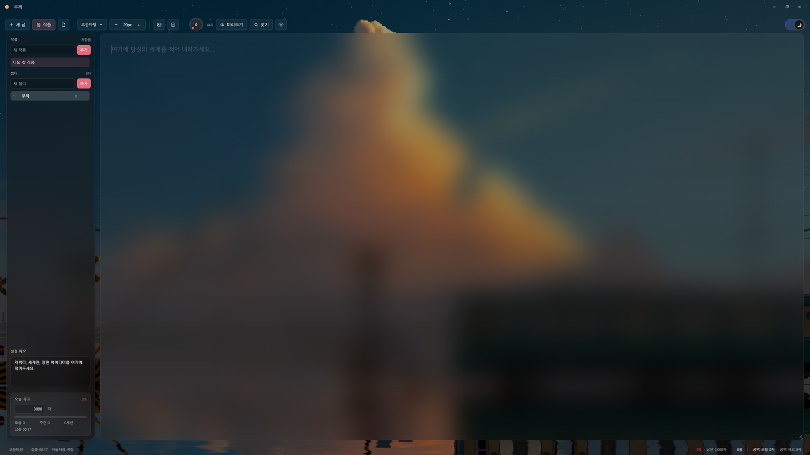
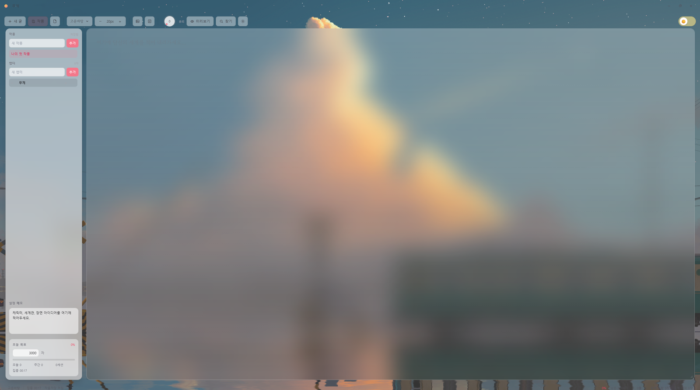
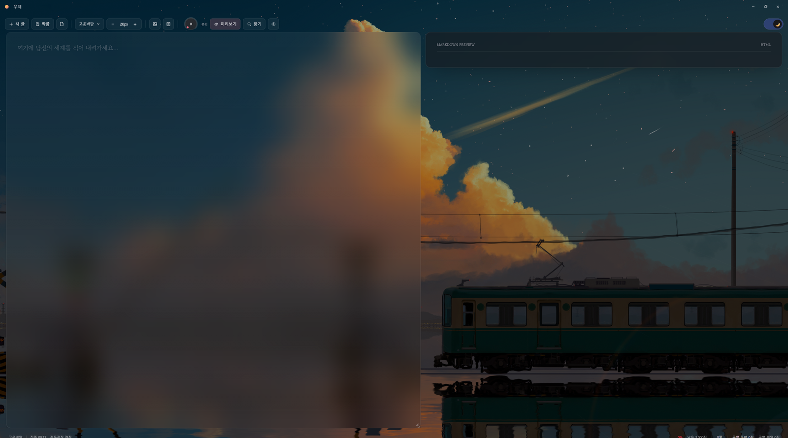
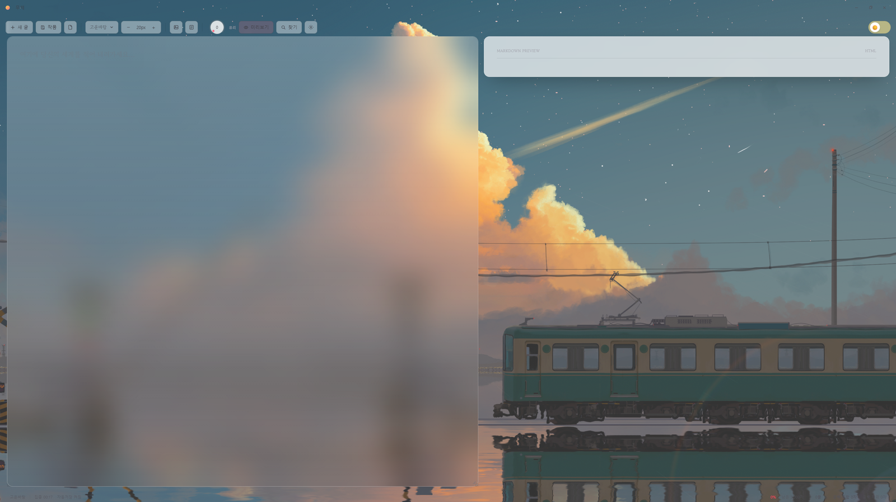

# ZenPad

> 똑같은 글을 쓰더라도 더 예쁜 노트에 — 긴 글에 몰입하기 위한 아름다운 윈도우 메모장.

ZenPad는 원고 집필이나 세계관 설정처럼 **챕터 단위의 긴 글**에 완전히 몰입할 수 있도록 만든 글래스모피즘 데스크톱 메모장입니다. Electron + React 기반의 프레임리스 윈도우 앱입니다.

## 📸 미리보기

| 다크 작업 화면 | 라이트 작업 화면 |
|---|---|
|  |  |
|  |  |

> v1.0.1 기준 미리보기: 작품/챕터 관리, 라이트·다크 테마, 마크다운 미리보기, 본문 검색, 노트 양식, 집필 통계, 안전 저장 흐름.

## ✨ 주요 기능

- **프레임리스 윈도우** — OS 기본 타이틀 바를 제거한 커스텀 타이틀 바(최소화·최대화·닫기), 드래그로 창 이동
- **작품/챕터 라이브러리** — 프로젝트와 챕터를 앱 안에서 생성·이름 변경·삭제하고, 챕터별 본문과 메모를 로컬에 저장
- **안전 저장 & 복구** — 텍스트 파일은 UTF-8 BOM으로 저장하고, 임시 파일에 먼저 쓴 뒤 교체해 저장 중 유실 위험을 줄임
- **자동 백업 & 복구** — 작업 중인 파일과 임시 문서를 주기적으로 백업하고, 비정상 종료 후 복구 제안
- **글래스모피즘 에디터** — 로컬 이미지를 전체 배경으로 설정하고 `backdrop-blur`로 반투명 유리 질감 구현
- **배경 이미지 보관** — 선택한 배경 이미지를 앱 데이터 폴더에 복사해 다음 실행 후에도 안정적으로 복원
- **유리 불투명도 다이얼** — 회전 다이얼로 에디터 배경의 투명도를 실시간·세밀하게 조절 (근접 시 확대 모션)
- **포커스 모드** — 타이핑을 시작하면 UI가 부드럽게 사라지고 글과 배경만 남으며, 마우스를 움직이면 다시 등장
- **마크다운 미리보기** — 원고 옆에서 제목·목록·인용·코드 블록이 반영된 미리보기 확인
- **본문 검색** — `Ctrl + F`로 현재 챕터에서 원하는 단어를 찾고 Enter 또는 버튼으로 다음/이전 결과 이동
- **테마 & 타이포그래피** — 부드러운 전환의 다크/라이트 모드, 3종 한글 웹폰트(나눔명조·고운바탕·노토 고딕) 선택, 글자 크기 조절
- **파일명 인라인 수정** — 좌상단 파일명을 클릭해 바로 이름 변경 (Enter·blur 확정)
- **에디터 크기 조절** — 드래그로 자유 리사이즈 + `16:9` / `9:14` 추천 비율 프리셋
- **집필 목표와 통계** — 공백 포함/제외 글자 수, 줄 수, 목표 달성률, 오늘/이번 주/현재 세션 집필량 표시
- **로컬 파일 I/O** — `.txt` 저장·불러오기, 파일명 변경, Markdown/HTML 내보내기 (Electron IPC)
- **오프라인 폰트** — 웹폰트를 앱에 동봉해 인터넷 없이도 동일한 서체 표시

## ⌨️ 단축키

| 단축키 | 동작 |
|---|---|
| `Ctrl + N` | 새 문서 |
| `Ctrl + O` | 불러오기 |
| `Ctrl + S` | 저장 |
| `Ctrl + Shift + S` | 다른 이름으로 저장 |
| `Ctrl + P` | 마크다운 미리보기 토글 |
| `Ctrl + F` | 현재 챕터 검색 |

## 🛠 기술 스택

- **Framework**: Electron + React (Vite)
- **Styling**: Tailwind CSS, Framer Motion
- **Fonts**: `@fontsource` (나눔명조 · 노토 산스 KR · 고운바탕)
- **Packaging**: electron-builder (NSIS)

## 🚀 개발 및 빌드

```bash
npm install        # 의존성 설치
npm run dev        # 개발 모드 (Vite + Electron, HMR)
npm run build      # 렌더러 프로덕션 빌드
npm run preview    # 빌드 결과 로컬 미리보기
npm run dist       # 윈도우 .exe 인스톨러 생성 (release/ 폴더)
```

## 📦 다운로드

빌드된 설치 파일은 [Releases](https://github.com/D5n0735/zenpad/releases) 에서 받을 수 있습니다.

## 📁 프로젝트 구조

```
zenpad/
├─ electron/
│  ├─ main.js          # 메인 프로세스: 프레임리스 윈도우 + IPC
│  └─ preload.cjs      # contextBridge로 안전한 API 노출
├─ src/
│  ├─ App.jsx          # 상태/단축키/라이브러리/자동 백업 오케스트레이션
│  ├─ components/
│  │  ├─ TitleBar.jsx  # 커스텀 타이틀 바 + 파일명 인라인 수정
│  │  ├─ Toolbar.jsx   # 폰트·크기·배경·테마·내보내기·비율 프리셋
│  │  ├─ Editor.jsx    # 글래스 에디터 + 크기 조절
│  │  ├─ MarkdownPreview.jsx
│  │  ├─ ProjectSidebar.jsx
│  │  ├─ SearchPanel.jsx
│  │  └─ StatusBar.jsx # 글자 수 + 목표 진행률
│  ├─ hooks/           # 환경설정, 라이브러리, 통계, 포커스 세션
│  ├─ lib/             # 마크다운 변환 유틸리티
│  └─ index.css
└─ package.json        # electron-builder 설정 포함
```
